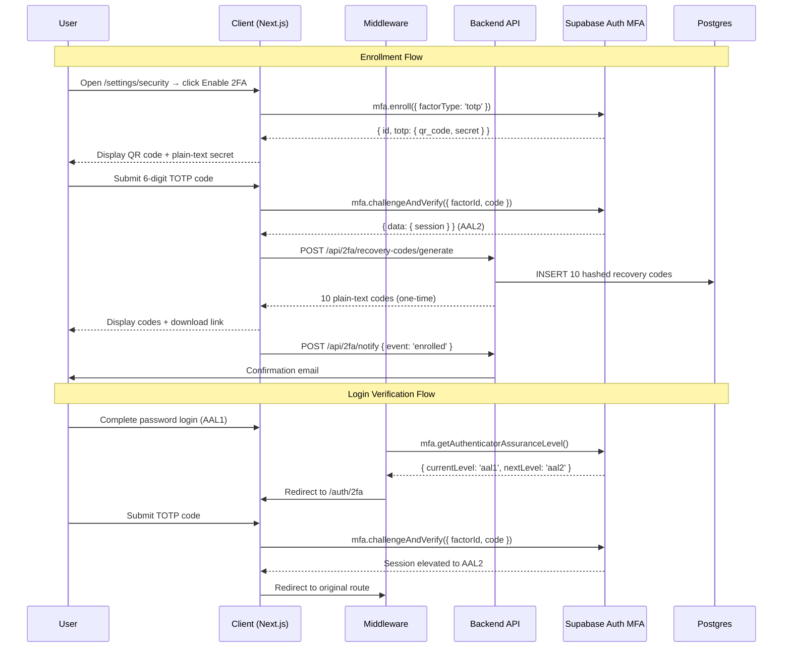

# Design Document: Two-Factor Authentication (TOTP)

## Overview

This document describes the technical design for adding TOTP-based two-factor authentication to SYNCRO. The implementation uses Supabase Auth MFA APIs as the TOTP engine, with SYNCRO owning recovery code generation, storage, and team-level enforcement logic.

The feature introduces two new pages (`/settings/security` and `/auth/2fa`), a middleware extension for AAL enforcement, a backend API for recovery code management, and a database migration for recovery codes and team enforcement policy.

---

## Architecture

The feature spans three layers:

1. **Client (Next.js)** — UI pages, enrollment flow component, 2FA verification page, security settings section, and middleware AAL guard.
2. **Backend (Express/Node)** — REST API routes for recovery code generation, verification, and invalidation; email notifications.
3. **Database (Supabase/Postgres)** — `recovery_codes` table and `require_2fa` column on `teams`.

Supabase Auth handles TOTP secret generation, QR code URI production, and TOTP code verification. SYNCRO does not implement TOTP cryptography itself.



---

## Components and Interfaces

### Client Components

**`/app/settings/security/page.tsx`** — Server component that fetches the user's MFA factors and team enforcement status, then renders `SecuritySettingsPanel`.

**`/components/security/SecuritySettingsPanel.tsx`** — Client component. Displays 2FA status, enabled date, enable/disable controls, and (for team owners) the enforcement toggle.

**`/components/security/TotpEnrollmentModal.tsx`** — Multi-step modal:
1. Display QR code + secret (from `mfa.enroll`)
2. Verify 6-digit code input
3. Show recovery codes + download button

**`/app/auth/2fa/page.tsx`** — Client page. Accepts TOTP code or recovery code input. Calls `mfa.challengeAndVerify` or the recovery code verification endpoint.

### Middleware Extension (`client/lib/supabase/middleware.ts`)

The existing `updateSession` function is extended to:
1. After session refresh, call `supabase.auth.mfa.getAuthenticatorAssuranceLevel()`.
2. If `currentLevel === 'aal1'` and `nextLevel === 'aal2'`, redirect to `/auth/2fa` (storing the original path in a `redirectTo` query param).
3. If the user has no 2FA but their team requires it, redirect to `/settings/security?enforce=true`.

Protected routes are all paths not matching `/`, `/auth/*`, `/api/*`, `/_next/*`.

### Backend API Routes (`backend/src/routes/mfa.ts`)

| Method | Path | Description |
|--------|------|-------------|
| POST | `/api/2fa/recovery-codes/generate` | Generate 10 recovery codes post-enrollment |
| POST | `/api/2fa/recovery-codes/verify` | Verify a recovery code and invalidate it |
| DELETE | `/api/2fa/recovery-codes` | Delete all recovery codes on 2FA disable |
| POST | `/api/2fa/notify` | Send enrollment/disable confirmation email |
| PUT | `/api/teams/:teamId/require-2fa` | Set team enforcement policy (owner only) |

All routes require the `authenticate` middleware. The generate and verify routes additionally check that the requesting user owns the codes.

### Recovery Code Service (`backend/src/services/mfa-service.ts`)

```typescript
interface RecoveryCodeService {
  generate(userId: string): Promise<string[]>          // returns 10 plain-text codes
  verify(userId: string, code: string): Promise<boolean>
  invalidateAll(userId: string): Promise<void>
}
```

`generate` uses `crypto.randomBytes(10).toString('hex')` for each code, bcrypt-hashes each with cost factor 12, and bulk-inserts into `recovery_codes`.

`verify` fetches all unused codes for the user, runs `bcrypt.compare` against each, and on match sets `used_at = now()`.

### Rate Limiter for 2FA Verification

A dedicated in-memory rate limiter (extending the existing `rateLimiter.ts` pattern) tracks failed TOTP attempts per session ID:

- Window: 10 minutes
- Max failures: 5
- Lockout duration: 15 minutes

Applied to both the `/auth/2fa` page (client-side state) and the `/api/2fa/recovery-codes/verify` endpoint (server-side).

---

## Data Models

### `recovery_codes` table

```sql
create table public.recovery_codes (
  id          uuid primary key default gen_random_uuid(),
  user_id     uuid not null references auth.users(id) on delete cascade,
  code_hash   text not null,
  used_at     timestamptz,
  created_at  timestamptz not null default now()
);

create index recovery_codes_user_id_idx on public.recovery_codes(user_id);

alter table public.recovery_codes enable row level security;

-- Users can only read/delete their own codes (no direct insert from client)
create policy "recovery_codes_select_own"
  on public.recovery_codes for select
  using (auth.uid() = user_id);

create policy "recovery_codes_delete_own"
  on public.recovery_codes for delete
  using (auth.uid() = user_id);
```

Server-side inserts use the Supabase service role key (bypasses RLS).

### `teams` table extension

```sql
alter table public.teams
  add column if not exists require_2fa boolean not null default false,
  add column if not exists require_2fa_set_at timestamptz;
```

### `profiles` table extension

```sql
alter table public.profiles
  add column if not exists two_fa_enabled_at timestamptz;
```

This timestamp is set when enrollment verification succeeds and cleared when 2FA is disabled. It drives the "enabled since" display on the settings page.

### In-memory rate limit state (server-side)

```typescript
interface FailureRecord {
  count: number;
  windowStart: number;   // epoch ms
  lockedUntil?: number;  // epoch ms
}
// Map<sessionId, FailureRecord>
```

---

## Correctness Properties

*A property is a characteristic or behavior that should hold true across all valid executions of a system — essentially, a formal statement about what the system should do. Properties serve as the bridge between human-readable specifications and machine-verifiable correctness guarantees.*

### Property 1: Enrollment data contains QR code and secret

*For any* enrollment response returned by the MFA service, the rendered enrollment UI should contain both a QR code element and the plain-text secret string.

**Validates: Requirements 1.2**

---

### Property 2: Invalid TOTP code preserves form state

*For any* 2FA verification form (enrollment or login), submitting an invalid or expired TOTP code should result in an error message being displayed while the form remains open and the factor/session state is unchanged.

**Validates: Requirements 1.4, 3.3**

---

### Property 3: Successful enrollment persists 2FA enabled status

*For any* user, after enrollment verification succeeds, querying that user's profile should return a non-null `two_fa_enabled_at` timestamp.

**Validates: Requirements 1.5**

---

### Property 4: Recovery code generation produces 10 unique codes

*For any* user completing enrollment, the `generate` function should return exactly 10 strings, all of which are distinct from one another.

**Validates: Requirements 2.1**

---

### Property 5: Recovery codes are stored hashed

*For any* generated recovery code, the value stored in `recovery_codes.code_hash` should not equal the plain-text code, and `bcrypt.compare(plainText, storedHash)` should return true.

**Validates: Requirements 2.2**

---

### Property 6: Recovery code display renders all 10 codes

*For any* set of 10 generated plain-text recovery codes, the recovery code display component should render exactly 10 visible code elements.

**Validates: Requirements 2.3**

---

### Property 7: Recovery code download contains all codes

*For any* set of 10 plain-text recovery codes, the download blob produced by the download function should contain all 10 code strings.

**Validates: Requirements 2.4**

---

### Property 8: Recovery code single-use invariant

*For any* valid recovery code, using it once should succeed; using the same code a second time should fail (the code is marked used and `bcrypt.compare` still matches but the `used_at` guard rejects it).

**Validates: Requirements 2.5, 3.4**

---

### Property 9: AAL1 sessions with 2FA are blocked from protected routes

*For any* HTTP request to a protected route where the session is at AAL1 and the user has an enrolled TOTP factor, the middleware should redirect to `/auth/2fa` rather than serving the route.

**Validates: Requirements 3.1, 6.1**

---

### Property 10: Post-AAL2 elevation redirects to original route

*For any* originally requested route stored before the 2FA redirect, after the session is elevated to AAL2, the user should be redirected to that original route.

**Validates: Requirements 3.5**

---

### Property 11: Security settings page reflects 2FA state

*For any* user, the security settings panel rendered with `twoFaEnabled=true` should show the enabled date, and rendered with `twoFaEnabled=false` should show the enable button.

**Validates: Requirements 4.1, 4.2**

---

### Property 12: Disable 2FA requires valid credential

*For any* disable-2FA request that does not include a valid TOTP code or recovery code, the request should be rejected and the user's 2FA status should remain enabled.

**Validates: Requirements 4.3**

---

### Property 13: Disable 2FA clears all factors and recovery codes

*For any* user with 2FA enabled, after a successful disable operation, querying that user's Supabase MFA factors and `recovery_codes` rows should both return empty results.

**Validates: Requirements 4.4**

---

### Property 14: Team enforcement blocks disable for members

*For any* user who is a member of a team with `require_2fa=true`, the security settings panel should render the disable control as unavailable and display an enforcement message.

**Validates: Requirements 4.5**

---

### Property 15: Team enforcement policy persists on toggle

*For any* team, enabling the 2FA requirement should set `require_2fa=true` in the database, and disabling it should set `require_2fa=false`.

**Validates: Requirements 5.2, 5.5**

---

### Property 16: Unenrolled members in enforced teams are redirected to enrollment

*For any* user without an enrolled TOTP factor who belongs to a team with `require_2fa=true`, the middleware should redirect to the enrollment flow rather than the requested route.

**Validates: Requirements 5.3**

---

### Property 17: Rate limiter locks out after 5 consecutive failures

*For any* session, after 5 consecutive failed TOTP verification attempts within a 10-minute window, the 6th attempt within the lockout period should be rejected with a lockout error.

**Validates: Requirements 6.2**

---

### Property 18: 2FA lifecycle events trigger confirmation email

*For any* user who successfully enrolls or disables 2FA, the email service should be called exactly once with that user's registered email address and the appropriate event subject.

**Validates: Requirements 6.4**

---

## Error Handling

| Scenario | Behavior |
|----------|----------|
| `mfa.enroll` fails (Supabase error) | Show inline error in modal; do not advance step |
| `challengeAndVerify` returns invalid code | Increment failure counter; show error; keep form open |
| `challengeAndVerify` returns expired code | Same as invalid — TOTP window is 30 s, Supabase handles clock skew |
| Recovery code not found / already used | Return 401 from `/api/2fa/recovery-codes/verify`; show error on page |
| Rate limit exceeded | Return 429; show lockout message with remaining time |
| `mfa.unenroll` fails | Show error; do not delete recovery codes from DB |
| Team enforcement check fails (DB error) | Fail open — do not block login; log error |
| Email send fails | Log error; do not block the enrollment/disable operation (non-blocking) |

---

## Testing Strategy

### Unit Tests

Focus on specific examples, edge cases, and pure functions:

- `RecoveryCodeService.generate` — returns exactly 10 strings, all unique
- `RecoveryCodeService.verify` — correct code returns true; wrong code returns false; used code returns false
- `buildDownloadBlob(codes)` — output string contains all 10 codes
- `TotpRateLimiter` — lockout triggers at exactly 5 failures; resets after window expires
- `SecuritySettingsPanel` snapshot — renders correctly for enabled/disabled/enforced states
- `TotpEnrollmentModal` — step transitions work correctly

### Property-Based Tests

Use **fast-check** (already available via the TypeScript ecosystem) for all property tests. Each test should run a minimum of **100 iterations**.

Tag format: `// Feature: two-factor-authentication, Property {N}: {property_text}`

| Property | Test Description |
|----------|-----------------|
| P1 | Generate random enrollment responses; assert rendered output contains QR and secret |
| P2 | Generate random invalid codes; assert form state unchanged after submission |
| P3 | Generate random user IDs; after mock enrollment success, assert profile has timestamp |
| P4 | Run generate N times; assert each result has length 10 and all elements are unique |
| P5 | Generate random codes; assert stored hash ≠ plain text and bcrypt.compare passes |
| P6 | Generate random code arrays of length 10; assert display renders 10 elements |
| P7 | Generate random code arrays; assert download blob contains all codes |
| P8 | Generate random valid codes; use once (success), use again (failure) |
| P9 | Generate random protected paths + AAL1 sessions; assert middleware redirects |
| P10 | Generate random original routes; after AAL2 elevation, assert redirect target matches |
| P11 | Generate random 2FA states; assert panel renders correct controls |
| P12 | Generate random invalid credentials; assert disable is rejected |
| P13 | After disable, assert factors and recovery_codes are empty |
| P14 | Generate random enforced-team memberships; assert disable control is blocked |
| P15 | Toggle enforcement on/off; assert DB value matches toggle state |
| P16 | Generate unenrolled users in enforced teams; assert middleware redirects to enrollment |
| P17 | Simulate 5 failures then 6th attempt; assert lockout response |
| P18 | After enroll/disable, assert email service called once with correct address |

### Integration Tests

- Full enrollment flow: enroll → verify → generate codes → download (using Supabase test project or mock)
- Full login flow: password auth → AAL1 → redirect → TOTP verify → AAL2 → original route
- Recovery code login: password auth → AAL1 → redirect → recovery code → AAL2
- Team enforcement: owner enables → member logs in without 2FA → redirected to enrollment
